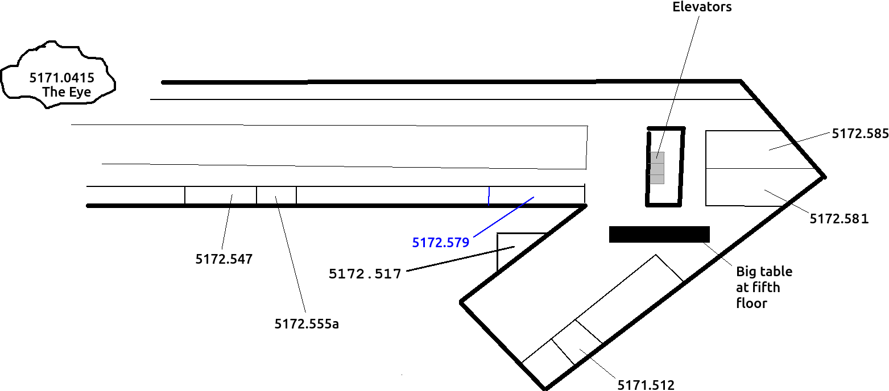

# internship_mart

Branch|
---|---
`master`|

Internship of Mart at the Rijksuniversiteit Groningen.

## [Report](report.md)

The intern will have to write a report in the end, with the research question:

> How do biologists investigate nature?

 * [View the report here](report.md)

## Where

 * Building: [Linnaeusborg](https://www.rug.nl/staff/location/5172), Nijenborgh 7, 9747 AG Groningen
 * Rooms:
    * Canteen, at ground floor
    * Theoretical Biological department, mostly at 5th floor

## Thursday September 26th 2019

Time       |What                                |Where
-----------|------------------------------------|-------------------------------------------------
08:30-09:00|Briefing Richel                     |Canteen of the Linnaeusborg at the Zernike campus
09:00-09:45|Meeting 1: Pedro Neves              |Room 5172.0547
10:00-10:45|Meeting 2: Marina Papadopoulou      |Room 5173.0512
11:00-11:45|Meeting 3: Lauren Seex              |Room 5173.0512
12:00-13:00|Lunch with Boris                    |Big table at the 5th floor
13:00-13:45|Meeting 4: Josh Lambert and Shu Xie |Room 5172.0547  
14:00-14:45|Meeting 5: Christoph Netz           |Room 5172.581
15:00-15:45|Meeting 6: Sajat Farahani           |Room 5172.517
16:00-17:00|Write report                        |Big table at the 5th floor

 * Reserve: Magdalena Kozielska-Reid, 5173.506

## Questions for supervisors

### Who is Mart?

Mart is a ?14 year old scholar,
that follows Richel's programming course.
He has been the lead tester of the game Nature Zen.

### What should I do during my slot

You can fill the time in any way you like.

Perhaps the most useful thing to do,
is to explain your work to the intern,
to verify that that you can (still) explain your scientific work to laymen.

Consider:

 * telling/showing your work
 * teaching some basic biology
 * showing some code/scripts 
 * show the lab/campus/Peregrine/etc
 * taking a walk

### A slot of 45 minutes is too long for one person

Slots can also be filled with more than one person :wink:

### Aaah! I cannot be there! What should I do?

It's fine. Just let Richel, Mart or any colleague know. 
We'll find a solution :+1:

### What is the goal of the internship?

To learn how working at a university is like.

### What will the interns deliver?

At that day, they'll hand in a report to answer the question:

> How do biologists investigate nature?

## Official documents

 * [Letter from Dollard College](brief_stagebieders_2018.pdf)